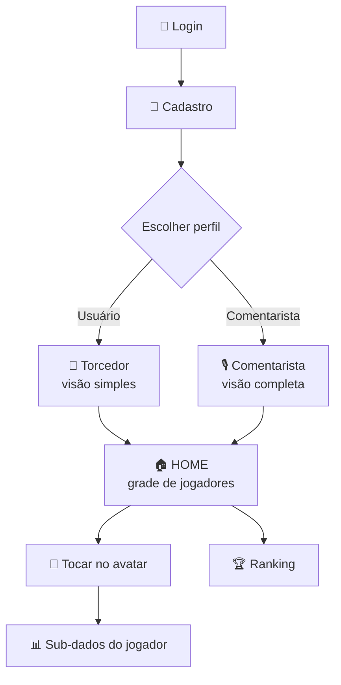

# 🏈 BolaMatch — Estatísticas de Jogadores da NFL

Aplicativo esportivo **mobile e web** que roda **offline**, feito em Python com
[Flet](https://flet.dev). O usuário faz login, escolhe um perfil
(**Torcedor** ou **Comentarista**) e explora os dados dos jogadores da NFL
(temporada 2021, semanas 1–8) tocando no avatar de cada jogador.

Os dados vêm dos arquivos do **NFL Big Data Bowl** (Next Gen Stats + Pro
Football Focus) lidos localmente — nada depende de internet.

---

## 👥 Participantes

- **Felipe Miguel Caetano Oliveira**
- **Marcos Paulo Lima Soares**
- **Gabrielle Gaya da Silva**
- **Rennan Fernandes de Mesquita**

---

## 📁 Onde ficam os arquivos

| Item | Caminho |
|------|---------|
| Código do app | `app/bolamatch.py` (app completo com login) |
| Leitura dos dados | `app/data_service.py` |
| Dados (CSVs) | `C:\Users\aluno\Downloads\data` |
| Cache de times | `app/player_team_cache.json` (gerado na 1ª execução) |
| Testes | `app/testar.py`, `app/testar_ui.py`, `app/testar_bolamatch.py` |

> ⚠️ A pasta atual está em `AppData\Local\Temp`, que o Windows pode limpar.
> Recomenda-se mover a pasta `app` para um local permanente (ex.: `Documentos`).

---

## 🚀 Como executar

> 📖 Guia detalhado passo a passo (com resolução de problemas):
> veja **[INSTRUCOES.md](INSTRUCOES.md)**.

```powershell
# 1) instalar a dependência (uma vez, precisa de internet só aqui)
py -m pip install -r app\requirements.txt

# 2) rodar (offline a partir daqui)
py -m flet run app\bolamatch.py          # janela no computador (desktop)
py -m flet run --web app\bolamatch.py     # no navegador (web)
py -m flet run --android app\bolamatch.py # no celular (app "Flet" + QR code)
```

> A **primeira execução** demora ~40s montando o cache de times (lê os
> arquivos de tracking uma vez). Depois fica rápido.

---

## 🧭 Fluxo do aplicativo



---

## 👥 Perfis de uso — Torcedor x Comentarista

O app tem dois perfis pensados para públicos diferentes. O **Torcedor** vê uma
versão simples e direta; o **Comentarista** vê a versão completa e técnica.

| Recurso | 🙋 Torcedor | 🎙️ Comentarista |
|---------|:----------:|:---------------:|
| Grade de avatares e busca | ✅ | ✅ |
| Aba **Lances** | ✅ (só o papel) | ✅ (quarter, papel, posição) |
| Aba **Jogos** | ✅ | ✅ (com nº de lances) |
| Aba **Minutagem** | ✅ | ✅ |
| Aba **Desempenho** | ✅ (frase simples) | ✅ (hits/hurries/sacks) |
| Aba **Participação** | ❌ | ✅ |
| **Ranking** | por minutagem/lances | todos os critérios + filtro de time |
| Linguagem | 💬 simples | 📈 técnica |

### 🙋 Tela do Torcedor (exemplo)

```
┌───────────────────────────────────────┐
│ 🛡️ BolaMatch          [🙋 Torcedor] ⏻ │
│ Toque no avatar para ver os dados 🏆   │
│ 🔎 Buscar jogador ou posição...        │
├───────────────────────────────────────┤
│  (T.B)   (P.M)   (A.R)   (J.A)         │
│  Brady   Mahomes Rodgers Allen         │
│   QB       QB      QB     QB           │
│                                        │
│  ► Ao tocar: Lances · Jogos ·          │
│    Minutagem · Desempenho · Posição    │
│                                        │
│  "Jogou muito! Fez a diferença." 💬    │
└───────────────────────────────────────┘
```

### 🎙️ Tela do Comentarista (exemplo)

```
┌───────────────────────────────────────┐
│ 🛡️ BolaMatch      [🎙️ Comentarista] ⏻│
│ Toque no avatar para ver os dados 🏆   │
│ 🔎 Buscar jogador ou posição...        │
├───────────────────────────────────────┤
│  ► Ao tocar: Lances · Jogos ·          │
│    Minutagem · Desempenho ·            │
│    Participação · Posição              │
│                                        │
│  Pressões: 3 hits, 5 hurries, 2 sacks  │
│  Ranking: todos os critérios + time 📈 │
└───────────────────────────────────────┘
```

---

## 📊 O que cada aba mostra

- **Lances** — jogadas em que o jogador participou (com a descrição real).
- **Jogos** — jogos do mais recente ao mais antigo.
- **Minutagem** — tempo estimado em campo por jogo (mm:ss).
- **Desempenho** — nota 0–100; no Comentarista, com hits, hurries e sacks.
- **Participação** *(só Comentarista)* — lances por jogo, sinalizando quedas.
- **Posição** — posição oficial, onde se alinhou, altura, peso e faculdade.

O **Ranking** ordena os jogadores por minutagem, lances, desempenho, sacks,
hurries, hits ou min/jogo, com filtros por **posição** e **time**.

---

## 🗂️ Dados utilizados (NFL Big Data Bowl)

| Arquivo | Conteúdo | Registros |
|---------|----------|-----------|
| `games.csv` | Jogos (times, data, semana) | 122 |
| `players.csv` | Cadastro dos jogadores | 1.679 |
| `plays.csv` | Jogadas (situação, cobertura, resultado) | 8.557 |
| `pffScoutingData.csv` | Pressão e bloqueio por jogada (PFF) | — |
| `tracking_[id].csv` | Posição/velocidade frame a frame | 122 arquivos |

**Observação honesta:** a base tem apenas a temporada 2021 (semanas 1–8).
Não há dados de temporadas anteriores, times anteriores do jogador, lesões ou
suspensões — esses campos não existem nos arquivos. A "minutagem" e a
"participação" são estimativas a partir do volume de lances, não valores
oficiais.

---

## ✅ Testes automáticos

```powershell
py app\testar.py             # camada de dados (carga, minutagem, ranking, filtros)
py app\testar_bolamatch.py   # interface do app completo (login -> home)
```

Se tudo estiver certo, aparece "TESTES PASSARAM" no final.

---

## 🛠️ Tecnologia

- **Python 3** + **Flet** (uma base de código para desktop, web e mobile).
- Leitura dos CSVs com a biblioteca padrão (`csv`), sem pandas.
- Interface responsiva com tema escuro.
